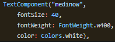

Цель работы: Создать(сверстать) три окна основываясь на предоставленных макетах, следую структуре и компоновки элементов.

Ход работы:

1. Первый макет

Рисунок 1 – макет

Готовое окно

Рисунок 2 – Готовое окно

Для обеспечения обрезки фотографии в верхней части использовалось наложение объекта сверху с его скалирование.

Рисунок 3 – Пример

1. Второй макет

Рисунок 4 – макет

Готовое окно

Рисунок 5 – готовое окно

Во избежание постоянного повторения схожих блоков, блок с информации об аудио был вынесен в отдельный компонент и подключался на месте с передачей нужных параметров

Рисунок 6 – музыка

1. Третий макет

Рисунок 7 – Макет

Готовое окно

Рисунок 8 – готовое окно

Для текстового виджета была создана обёртка, которая автоматически подключает FontFamily и добавляет дополнительные настройки для отображения. Позже везде вызывается данная обёртка для удобства.

Рисунок 9 – Текстовый компонент

Вывод: Создал(сверстал) три окна из предоставленных макетов.
