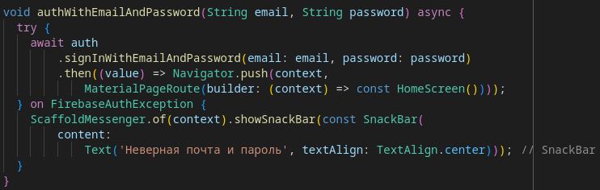

# Практическая работа 8

Цель работы: Реализовать приложение c авторизацией через firebase.

Ход работы:  
Окно авторизации  
  
Вход для анонимного пользователя  
  
Вход по почте  
  
Пример авторизации по почте и паролю  

