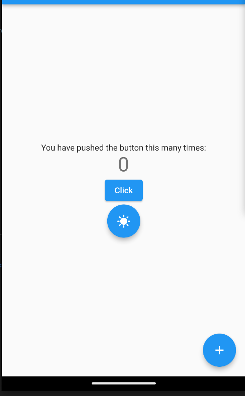
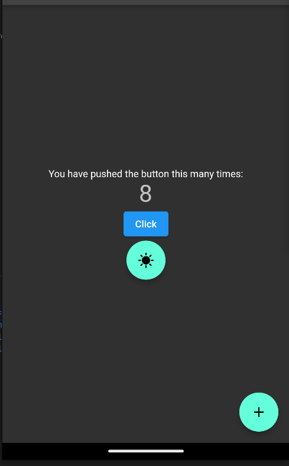
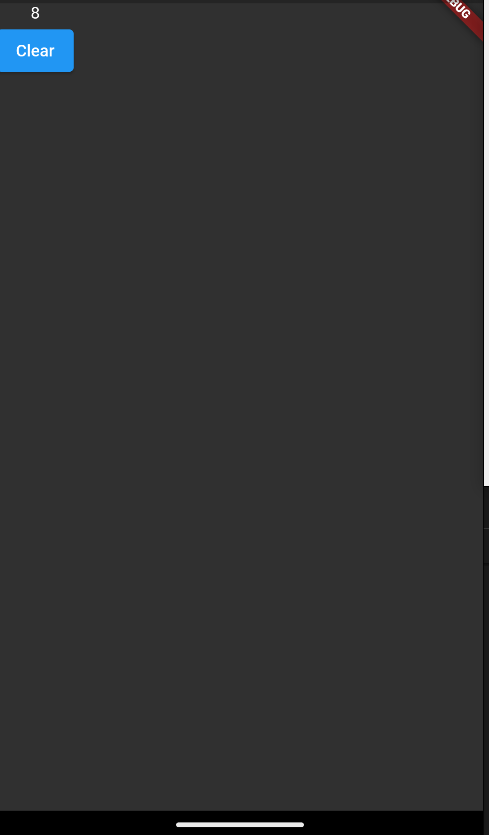
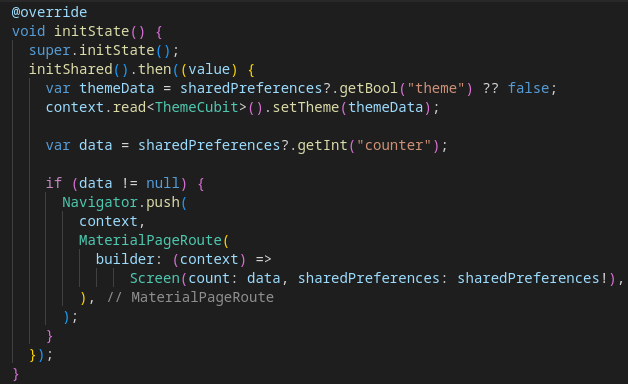

Сохранение данных после переходов между окнами и после перезапукска приложения

Стартовое окно

Увеличиваем счётчик и меняем тему в окне

Переходим на второй экран

Инициализация с установкой темы и стартового окна после запуска
