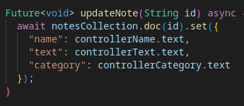

# Практическая работа 9

Цель работы: Реализовать приложение c CRUD действиями через firestore.

Ход работы:  
Вывод всех хаписей  
  
Создание новых и вывод уже оставшихся записей  
  
Пример создания   
  
Пример редактирования  
