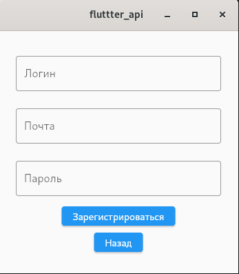

# Практическая работа 7

Цель работы: Реализовать приложение с использованием ранее написанной [API](https://github.com/StounhandJ/dart-api) со всеми доступными функциями.

Ход работы:

Окно входа

Окно регистрации

Список заметок

Создание заметки

Действия с заметкой

Изменение информации о текущем пользователе

Модель заметок

Модель пользователя

Пример метода для запроса

Вывод: Реализовал приложение с использованием ранее написанной [API](https://github.com/StounhandJ/dart-api) со всеми доступными функциями.
