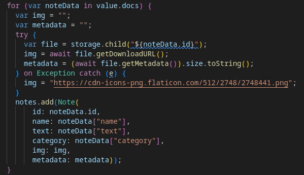
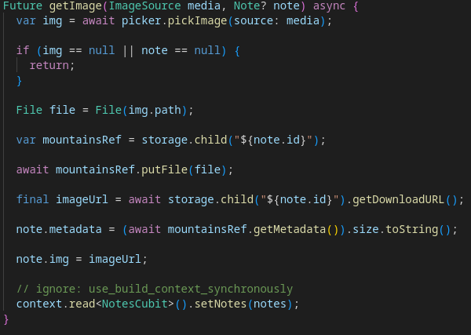
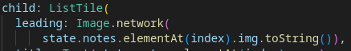

# Практическая работа 10

Цель работы: Реализовать приложение c возможность выгрузкой файлов в firebase sotrage  

Ход работы:  
Получение записей из базы, с паралелным запросом изображения к ним. Изображение привязывается к записи при помощи его id. Если изображения нет, то берётся базовая картинка информирующая о пустоте.   
  
Код для выгрузки изображения в хранилище из выбранной медии (по дефолту ниже указано из файлов)  
   
Отоброжение картинки в вёрстке   
  
