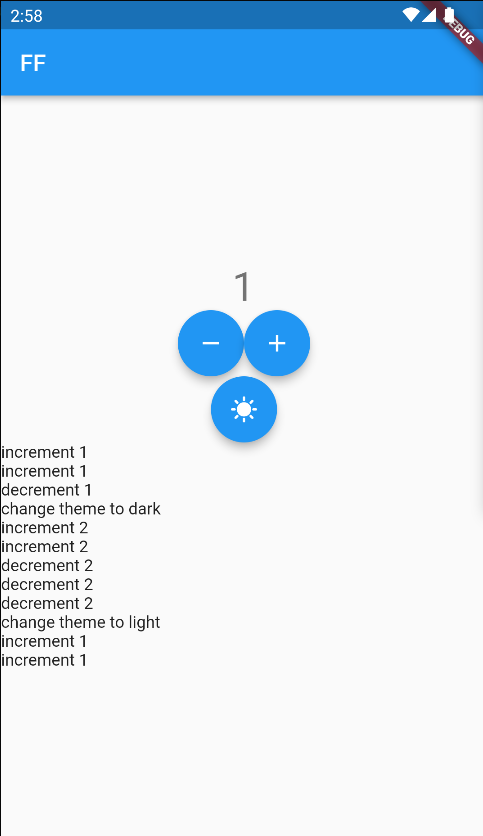
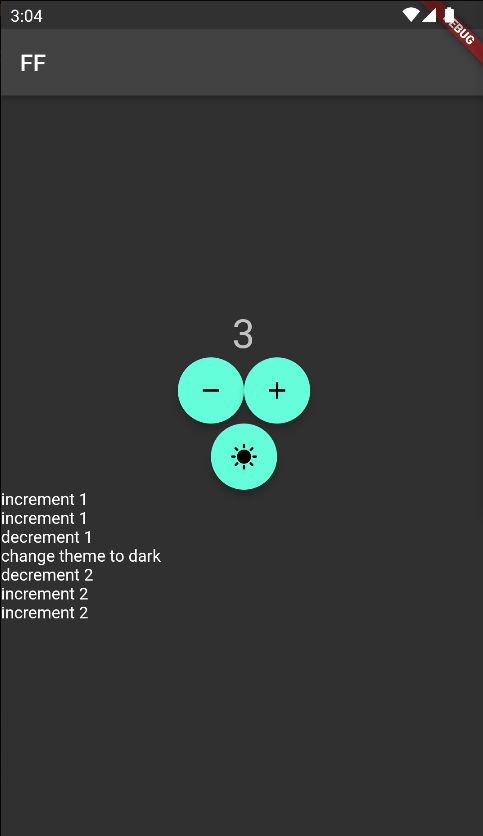
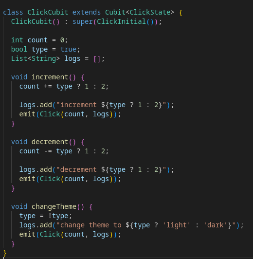
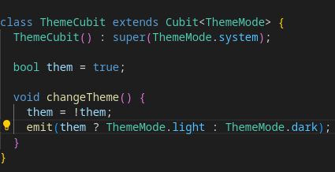
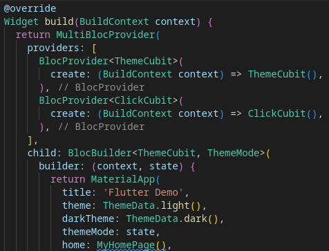

# Третий проект

Работа с Cubit. Задание: Инкремент и декримент значение при помощи Cubit. В тёмной теме инримент и декримент 2. Так же необходимо логировать все действия

Cubit для обработки нажатия инкримента и дикримента

Cubit для смены темы

Использование MultiBlocProvider для работы с несколькими Cubit внутри context
